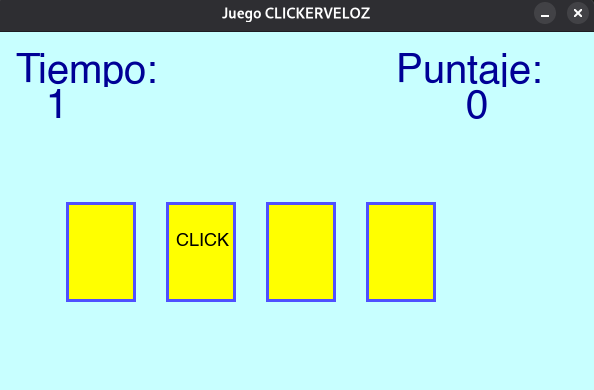

Markdown
# ClickerVeloz 🖱️⚡

**¡Bienvenido a *ClickerVeloz*!** Un juego de reflejos y precisión creado con **Pygame** donde debes hacer clic en la tarjeta correcta antes de que se acabe el tiempo.

---

## 🎮 Descripción del Juego

- Tienes **10 segundos** para lograr **3 puntos**.
- Cada **0.5 segundos**, una tarjeta muestra la palabra **"CLICK"**.
- **Haz clic en esa tarjeta** para ganar un punto.
- **¡Cuidado!** Si haces clic en una tarjeta equivocada, **pierdes un punto**.
- Gana antes de que termine el tiempo → **¡VICTORIA!**
- Si se acaba el tiempo → **DERROTA**

---

## 🚀 Características

- Interfaz limpia y colorida.
- Temporizador en tiempo real.
- Contador de puntaje.
- Feedback visual inmediato (verde = acierto, rojo = error).
- Pantalla final con resultado y puntaje.
- Totalmente jugable con ratón.

---

## 📂 Estructura del Proyecto

```
clickerveloz.py
└── Código principal del juego
```

---

## ⚙️ Requisitos

- **Python 3.6 o superior**
- **Pygame** (`pip install pygame`)
- **Si no te deja instalar modulos intenta creando un entorno venv:**

### bash
```bash
python3 -m venv venv
```
### CMD
```cmd
cd /ruta/a/tu/proyecto/clickerVeloz
```
## Activa y desactiva tu entorno venv
### bash
```bash
source venv/bin/activate

#Para cerrar el entorno
deactivate
```
### CMD
```cmd
venv\Scripts\activate

#Para cerrar el entorno
deactivate
```
### Ahora si puedes instalar modulos

---

## 🛠️ Instalación

1. Clona o descarga este repositorio.
2. Instala Pygame:

```bash
pip install pygame
```

3. Ejecuta el juego:

```bash
python clickerveloz.py
```

---

## 🎯 Cómo Jugar

1. Abre el juego.
2. Observa las **4 tarjetas amarillas**.
3. Cuando una diga **"CLICK"**, **¡haz clic en ella rápidamente!**
4. Logra **3 aciertos** antes de los **10 segundos**.
5. ¡Sé el más rápido!

---

## 🎨 Personalización (Opcional)

Puedes modificar fácilmente:

| Parámetro | Archivo | Descripción |
|---------|--------|-------------|
| `TIME_LIMIT` | `clickerveloz.py` | Tiempo total del juego (segundos) |
| `WIN_SCORE` | `clickerveloz.py` | Puntos necesarios para ganar |
| `NUM_CARDS` | `clickerveloz.py` | Número de tarjetas |
| `wait_timer = 20` | Bucle principal | Tiempo entre cambios de tarjeta (en frames) |

---

## Captura de Pantalla


---

## 👨‍💻 Autor

- **Tec-Labs-Solutions**  
  *Desarrollado con ❤️ y Pygame*

---

## 📄 Licencia

Este proyecto es de código abierto bajo la licencia **MIT**. ¡Siéntete libre de usarlo, modificarlo y compartirlo!

---

## 🎉 ¡Diviértete y mejora tus reflejos!

> **Tip**: Practica en modo fácil (aumenta `TIME_LIMIT` a 20) antes de retar a tus amigos.

---

